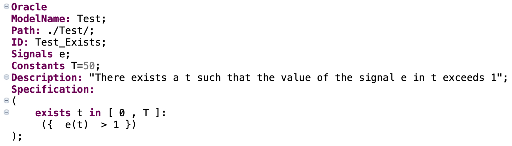

# SOCRaTEs: Simulink Oracles for CPS RequiremenTs with uncErtainty

### Menghi Claudio, Nejati Shiva,  Khouloud Gaaloul,  Lionel Briand

- Section [Publications](#publications) provides an overview of the publications that describe the theoretical foundations of this work.

- Section [Overview](#overview) provides an overview on SOCRaTEs.

-   Section [Installation and Project Creation](#installation-and-project-creation) describes how to install
    SOCRaTEs and how to create your first SOCRaTEs project.

-   Section [Using SOCRaTEs](#using-socrates) describes how to use SOCRaTEs.

-   Finally Section [Tutorial](#tutorial) provides a tutorial that describes how to
    use SOCRaTEs on a set of simple examples.

Publications
========
- Generating Automated and Online Test Oracles for Simulink Models with Continuous and Uncertain Behaviors 
<i>Menghi Claudio, Nejati Shiva,  Khouloud Gaaloul,  Lionel Briand 
Joint Meeting on Foundations of Software Engineering, ESEC/FSE'19  
(ACM SIGSOFT Distinguished Paper Award)
</i>

Overview
========

Figure 1 shows an overview of SOCRaTeS (*Simulink Oracles for CPS
RequiremenTs with uncErtainty*), our approach to generate automated test
oracles for CPS models. SOCRaTeS takes three inputs: (1) a CPS
model with parameters or inputs involving uncertainties, (2) a
set of functional requirements for the CPS model and (3) a set
of test inputs that are developed by engineers to test the CPS model
with respects to its requirements. SOCRaTeS makes the following
assumptions about its inputs:

-   *The CPS model is described in Simulink* (1). Simulink
    allows specifying dynamic systems, it is executable and allows
    engineers to test their models as early as possible.

-   *Functional requirements are described in a signal logic-based
    language* (2). We present our requirements language later in
    this document.

-   *A set of test inputs exercising requirements are provided*
    (3). We assume engineers have a set of test inputs for their
    CPS model. The test inputs may be generated manually, randomly or
    based on any test generation framework proposed in the literature.
    SOCRaTeS is agnostic to the selected test generation method.

SOCRaTeS automatically converts functional requirements into oracles
specified in Simulink (4). The oracles evaluate test outputs of
the CPS model in an automated and online manner and generate fitness
values that provide engineers with a degree of satisfaction or failure
for each test input (5). Engineers can stop running a test in
the middle when SOCRaTeS concludes that the test fitness is going to
remain below a given threshold for the rest of its execution.

Installation and Project Creation
=================================

Prerequisite
------------

The following software must be installed on your laptop to run Socrates

-   Eclipse [https://www.eclipse.org/](https://www.eclipse.org/)

-   Java 1.8 or superior

-   Matlab/Simulink

Exporting Socrates
------------------

Socrates can be exported from source code as a single jar file.
Using the exported jar file, users have an alternative to run
requirement translation in pure Command-Line style.

The detailed instructions are introduced in [SOCRaTEs-CLI.md](SOCRaTEs-CLI.md).

The following sections are the instructions for socrates usage in Eclipse.

Installing Socrates
-------------------

Socrates can be installed by performing the following steps:

-   Download the last version of SOCRaTEs from [https://github.com/claudiomenghi/SOCRaTEs/releases](https://github.com/claudiomenghi/SOCRaTEs/releases)

-   Click on Help > Install new Software > Add > Local

-   Select the Plugin folder;

-   Uncheck Group items by category;

-   Select Socrates SDK feature;

-   Click on Next > Next > I accept > Finish.

Creating a New Project
----------------------

To create a new project perform the following steps:

-   File > New > Project;

-   Select Project from General;

-   Click on Finish;

Using SOCRaTEs
==============

Creating a file with your Requirements
--------------------------------------

-   Create a file .socrates (File > New > File);

-   When asked to convert into an Xtext project click on Yes.

Generating the .m files using Socrates
--------------------------------------

-   copy the file demo.socrates within your workspace.

-   Change the file (e.g., add a new blank line) and save it

-   When you save the file a file .m is automatically created in the
    folder src-gen/ModelName.

Adding the oracles into your model
----------------------------------

-   Open the Simulink model test

-   Copy the file Test\_Req.m into your workspace

-   Run Test\_Req in Matlab

-   tollerableriskTest\_Req=0;

-   Run your simulation

Tutorial
========

We consider four different scenarios obtained by considering two
different models and two requirements.

The Considered Models
---------------------

The first model generates a sine wave with amplitude 2 and frequency
1 rad/s that is represented in Figure 2.

The second model generates a sine wave with amplitude 0.5 and
frequency 1 rad/s that is represented in Figure 3.

The Considered Requirements
---------------------------

The first requirement (Test_Forall) specifies that always the signal
e should not exceed the value 1. The requirement Test_Forall is
reported in Figure 4.

The second requirement (Test_Exists) specifies that there exists a
time instant in which the signal e exceeds the value 1. The
requirement Test_Exists is reported in Figure 5.

Replicating the Scenarios
-------------------------

To replicate the scenario

-   open Matlab

-   rename the selected model into `Test.slx`

-   open the file `Test.slx` in Simulink

-   open SOCRaTEs

-   create a new proect as previously described

-   add the file `tutorial.socrates` to your project

-   add an empty line to the file `tutorial.socrates` and save it

-   copy the `.m` file associated with the desired requirement from
    `src-gen/Test` to the Matlab workspace

-   run the `.m` file

-   set the value of the tollerableriskTest_Forall and tollerableriskTest_Exists variables to $0$

-   run the Simulink simulator

Scenario 1
----------

In scenario 1 the model Model 1 and the requirement Test_Forall are
considered. The evaluation of the oracle over time is presented in
Figure 6.

The oracle stops as soon as the requirement is detected to be violated.
The variable result\_Test\_Forall.Data contains the final result that
for this simulation is: -0.0109. Note that the result is negative. The
property is indeed violated.

Scenario 2
----------

In scenario 2 the model Model 2 and the requirement Test_Forall are
considered. The evaluation of the oracle over time is presented in
Figure 7.

The variable result_Test_Forall.Data contains the final result that
for this simulation is: 0.3333. Note that the result is positive. The
property is indeed satisfied.

Scenario 3
----------

In scenario 3 the model Model 1 and the requirement Test\_Exists are
considered. The evaluation of the oracle over time is presented in
Figure 8.

The variable result_Test_Exists.Data contains the final result that
for this simulation is: 0.5. Note that the result is positive. The
property is indeed satisfied.

Scenario 4
----------

In scenario 4 the model Model 2 and the requirement Test\_Exists are
considered. The evaluation of the oracle over time is presented in
Figure 9.

The variable result_Test_Exists.Data contains the final result that
for this simulation is: -0.3333. Note that the result is negative, and
the simulation stops as soon as the upper-bound of the interval
constrained by the exist operator is reached. The property is indeed not
satisfied.

Developers corner
========
Instruction to install SOCRaTEs
-   Install eclipse (https://www.eclipse.org/downloads/packages/release/kepler/sr1/eclipse-ide-java-developers)
-   Install the Xtext (https://www.eclipse.org/Xtext/) and Xtend (https://www.eclipse.org/xtend/download.html) eclipse plugins
-   Install Maven
-   git clone https://github.com/SNTSVV/SOCRaTEs.git
-   File > Import > Existing Maven Projects > Select the folder where the sources have been downloaded
-   Right click on the project lu.uni.socrates > Properties > Java Build Path > And make sure that the rfol library is in your build path. I had also made it available at (https://github.com/claudiomenghi/RFOL/releases/tag/0.0.1-SNAPSHOT)
-   Right click on the project lu.uni.socrates > Run as > Eclipse Application > Launch Runtime Eclipse > If error exists click to proceed
-   Now you can follow the standard User Guide.
